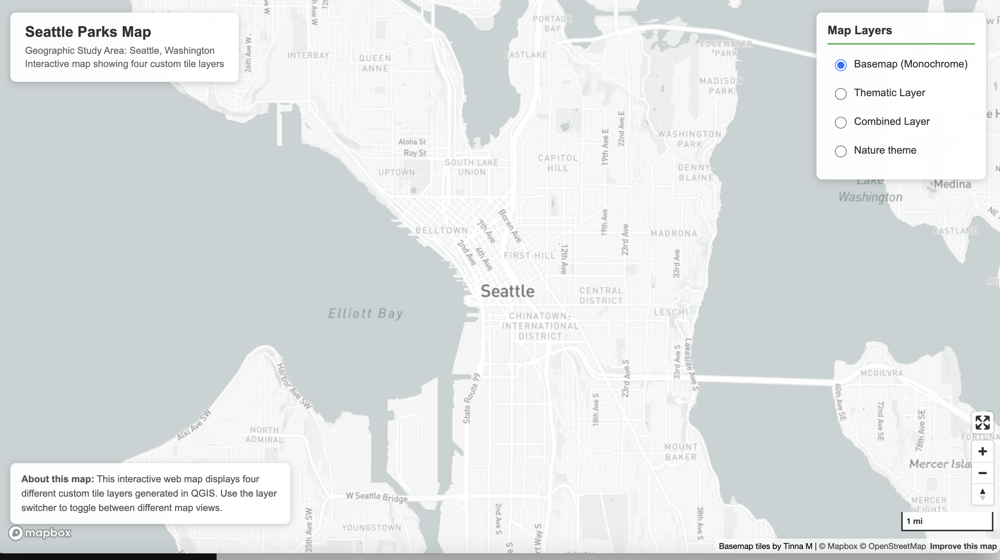
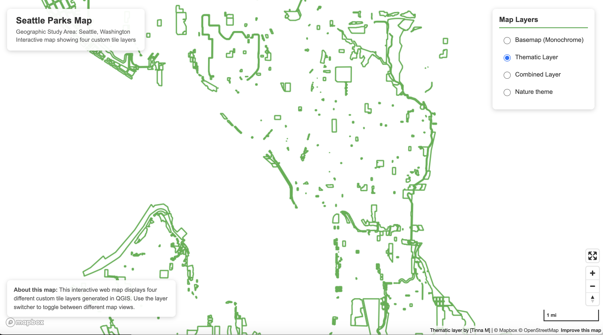
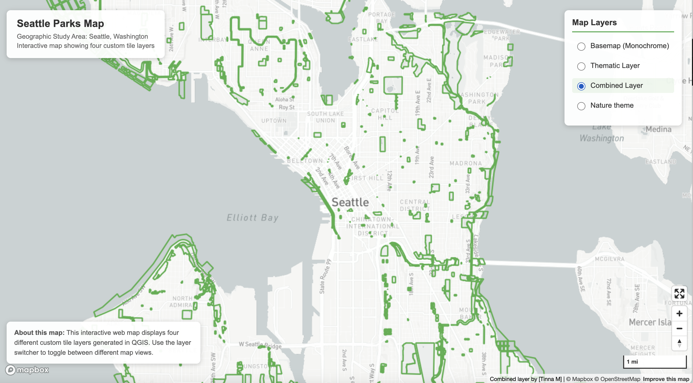
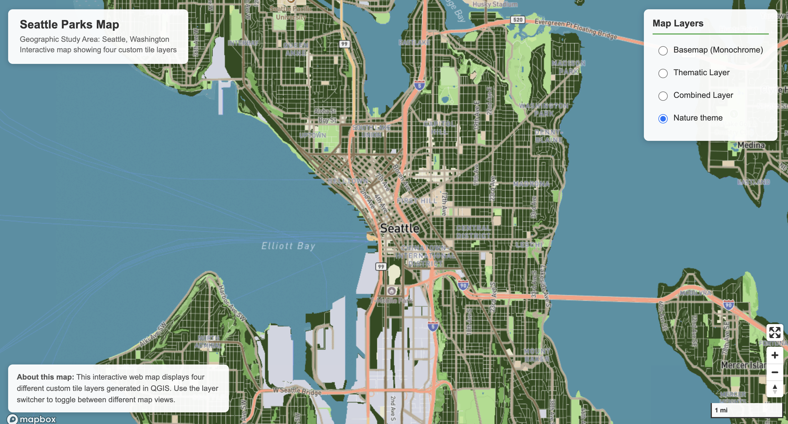

# Lab 4: Map Design and Tile Generation

**Author:** Tinna M  
**Date:** 4 February 2026

## Web Map URL
🌐 **Live Map:** [https://tinnam11.github.io/seattle_park_maptiles/](https://tinnam11.github.io/seattle_park_maptiles/)

---

## Project Description

This project creates an interactive web map displaying four custom tile layers generated in QGIS and visualized using Mapbox GL JS. The map allows users to switch between different cartographic perspectives of Seattle's parks and recreation areas.

---

## Geographic Area

**Study Area:** Seattle, Washington

**Bounding Box:**
- North: 47.73°
- South: 47.49°
- East: -122.24°
- West: -122.44°

**Justification:** Seattle was chosen as the study area to showcase the city's extensive parks and recreation system. The limited extent keeps tile sizes manageable while providing comprehensive coverage of the urban park network.

---

## Available Zoom Levels

| Tileset | Zoom Level Range | Rationale |
|---------|------------------|-----------|
| **Tileset 1: Basemap** | 10-15 | Full context from city-wide view to neighborhood detail |
| **Tileset 2: Seattle Parks** | 11-15 | Parks most visible at neighborhood zoom levels |
| **Tileset 3: Combined Layer** | 11-15 | Matches thematic layer for consistency |
| **Tileset 4: Nature Theme** | 10-15 | Full range like basemap for complete coverage |
---

## Tile Set Descriptions

### 1. Tileset 1: Monochrome Basemap

**Description:** A monochrome basemap created in Mapbox Studio using a Classic style as the foundation. This layer uses a grayscale color scheme with light gray for the background, medium gray for water features, and darker grays for roads and infrastructure. The basemap provides geographical context while remaining visually subtle to allow thematic layers to stand out.

**Customizations Made:**
- Modified color palette to grayscale tones
- Adjusted label font for better readability
- Changed water color to complement the monochrome scheme
- Modified icon styles for landmarks

**Data Source:** Mapbox Studio (Classic Style - Monochrome Light)  
**Projection:** Web Mercator (EPSG:3857)  
**Tile Count:** ~1,300 tiles  
**Purpose:** Provides clean geographical context for overlaying thematic data

---

### 2. Tileset 2: Seattle Parks Thematic Layer

**Description:** This thematic layer displays all properties owned and managed by Seattle Parks and Recreation within city limits. Parks and recreation facilities are shown as green polygons with dark green outlines on a transparent background. This visualization highlights the distribution and accessibility of public recreational spaces throughout Seattle.

**Data Details:**
- **Dataset:** Seattle Parks and Recreation Properties
- **Features Included:** Public parks, recreational facilities, SPR-managed properties
- **Styling:** 
  - Fill color: Medium green (#52c41a) at 60% opacity
  - Stroke color: Dark green (#2d5016)
  - Stroke width: 2.5px
  - Transparent background for overlay compatibility

**Data Source:** Seattle Open Data Portal  
**Original CRS:** EPSG:4326 (WGS 84)  
**Projection:** Web Mercator (EPSG:3857)  
**Tile Count:** ~1,200 tiles  
**Note:** Dataset includes all SPR-managed properties, not exclusively traditional parks, providing a comprehensive view of public recreational infrastructure.

---

### 3. Tileset 3: Combined Layer (Parks + Basemap)

**Description:** This integrated layer combines the Seattle Parks thematic data (Tileset 2) overlaid on the monochrome basemap (Tileset 1). This composite view provides users with both geographical context and thematic information simultaneously, showing how parks relate to the broader urban infrastructure, streets, and neighborhoods.

**Purpose:** Demonstrates the spatial relationship between parks and the urban fabric of Seattle. Users can see which neighborhoods have good park access and identify gaps in recreational space distribution.

**Technical Details:**
- Generated by displaying both basemap and parks layers simultaneously in QGIS
- Exported as a single combined tileset
- Maintains transparency where no parks exist

**Projection:** Web Mercator (EPSG:3857)  
**Tile Count:** ~1,200 tiles

---

### 4. Tileset 4: Nature-Themed Map

**Description:** A custom-designed map layer created in Mapbox Studio with a **Nature/Environment theme**. This thematic style uses earth tones and natural colors to evoke an outdoor, environmental aesthetic that complements the parks focus of this project.

**Theme Elements:**
- **Color Palette:** 
  - Water: Natural blue tones
  - Vegetation/Parks: Various shades of green
  - Roads: Muted earth tones (browns and tans)
  
- **Typography:** 
  - Organic, readable font choices
  - Green and brown text colors
  
- **Design Philosophy:** 
  The nature theme reinforces the environmental and outdoor recreation focus of the map series, creating visual harmony with the parks thematic data.

**Data Source:** Mapbox Studio (Custom Nature Theme Style)  
**Base Style:** Classic Mapbox template, heavily customized  
**Projection:** Web Mercator (EPSG:3857)  
**Tile Count:** ~1,300 tiles

---

## Screenshots

### Tileset 1: Monochrome Basemap

### Tileset 2: Seattle Parks Thematic Layer

### Tileset 3: Combined Layer

### Tileset 4: Nature-Themed Map

---

## Map Features

The interactive web map includes:

**Full-screen display** - Map fills entire browser window  
**Layer switcher** - Radio buttons to toggle between four tile layers  
**Navigation controls** - Zoom in/out buttons and compass  
**Scale bar** - Shows map scale in miles (imperial units)  
**Fullscreen control** - Expand map to fullscreen mode  

---

## Technologies Used

- **QGIS** - Tile generation using QMetaTiles plugin
- **Mapbox GL JS** - Web map visualization
- **Mapbox Studio** - Basemap and themed layer design

---

## Data Sources

- **Basemap & Themed Map:** Mapbox Studio Classic Styles
- **Seattle Parks Data:** [Seattle Open Data Portal](https://data.seattle.gov/)
  - Dataset: Seattle Parks and Recreation Properties
  - License: Public Domain
- **Map Projection:** EPSG:3857 (Web Mercator)

---

## Known Issues & Limitations

- Tile coverage limited to Seattle area only
- Some edge tiles may not load (404 errors) - this is expected behavior outside the export extent
- Zoom levels restricted to 10-15 to meet GitHub file size constraints
- Map requires internet connection for Mapbox GL JS library and base styles

---

## Acknowledgments

- **Instructor:** Bo Zhao, University of Washington
- **Course:** GEOG 458 - Advanced Digital Geographies
- **Data Provider:** Seattle Parks and Recreation, City of Seattle
- **Mapping Platform:** Mapbox

---

## License

This project was created for educational purposes as part of GEOG 458 at the University of Washington.

---